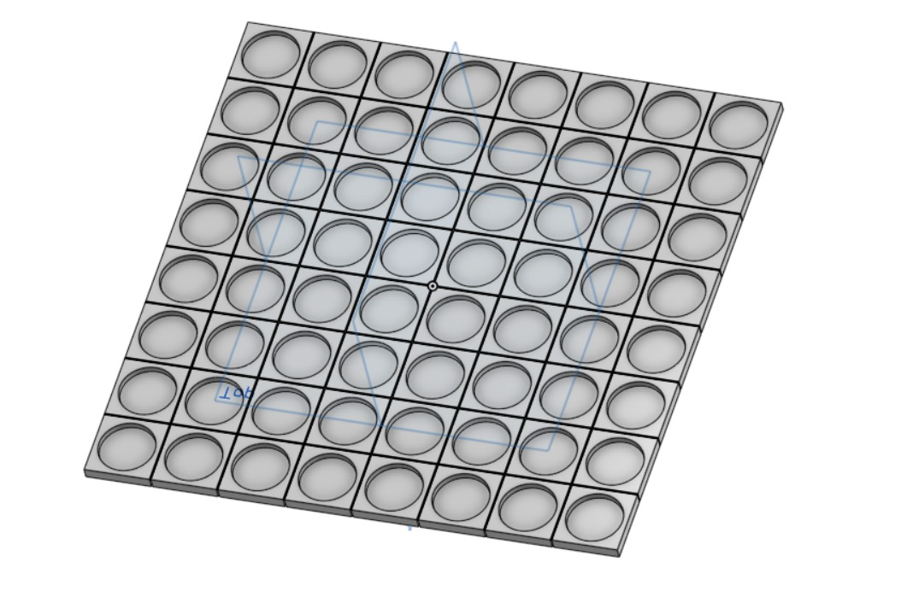

# Druck-It-Yourself Lichtschach
**3D-Druck-Schachspiel mit interaktiver Beleuchtung**

## **Projektbeschreibung**  
Im Rahmen eines Studienprojektes wird ein interaktives Schachspiel entwickelt, das durch ein individuell steuerbares Lichtsystem modernisiert wird. Ziel des Projekts ist es, ein möglichst kostengünstiges, modular aufgebautes und individuell anpassbares Schachbrett zu entwerfen, das sich sowohl für den Nachbau durch 3D-Druck Hobbyisten als auch für eine quelloffende Weiterentwicklung durch Schachenthusiasten eignet.

## **Kernfunktionen**  
- **3D-gedrucktes Design**: Alle relevanten Teile, einschließlich Figuren und Brett, werden selbst hergestellt und können nach individuellen Vorlieben angepasst werden.  
- **LED-Beleuchtung für jedes Feld**: Jedes der 64 Felder kann unabhängig voneinander mit verschiedenen Farben beleuchtet werden.  
- **Interaktive Zughilfe**: Beim Anheben einer Figur werden durch eine Lichtvisualisierung die möglichen legalen Züge hervorgehoben. Dies soll neben der visuellen Ästhetik vor allem als Lernhilfe für das Spiel dienen.
- **Webinterface mit ESP32**:  
  - Konfiguration der Spielerfarben und Beleuchtungseinstellungen  
  - Anzeige einer Schachuhr  
  - Aufzeichnung des Spielverlaufs zur Analyse  

## **Mögliche zusätzliche Features**  
- **Spielen gegen eine KI**: Die Züge der KI werden per Lichtsignal auf dem Schachbrett dargestellt, sodass der Spieler sie physisch für den Computer ausführt.  
- **Briefschach-Modus**: Zwei Schachbretter können gekoppelt werden, sodass Fernpartien über die Web-App möglich sind. Die Züge des Gegners werden automatisch auf dem eigenen Brett visualisiert.
- **Alternative-Spielmodi**: Spielsonderformen wie Blitzschach
- **Schachrätsel**: Vorgabe von Schachstellung gegen KI
- **Soundengine**: Dem Spiel könnten Audioeffekte über die WepApp oder einen verbauten Lautsprecher hinzugefügt werden
- **Lichtspiel**: Mit der Lichtmatrix können kleine Animationen auf dem Spielfeld dargstellt werden. Diese könnten auf Spielereignisse reagieren.

## **Technische Umsetzung WIP**  
Das Schachbrett wird mit einer eingebetteten Mikrocontroller-Lösung, z. B. einem ESP32, gesteuert. Die Felder sollen mit adressierbaren LED-Strips illuminiert weden. Die Weboberfläche wird lokal über die ESP32-WLAN-Funktionalität bereitgestellt, um eine einfache Bedienung und Anpassung zu ermöglichen.  

## **Warum?**  
Dieses Projekt verbindet klassisches Schach mit moderner Technologie und bietet eine spannende Herausforderung in den Bereichen 3D-Druck, Mikrocontroller-Programmierung und Webentwicklung. Durch den modularen Ansatz eignet es sich sowohl für individuelle Anpassungen als auch als Open-Source-Lösung für die Maker-Community.  

